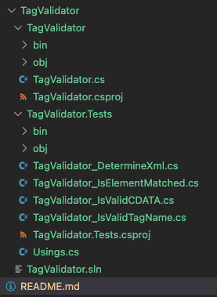
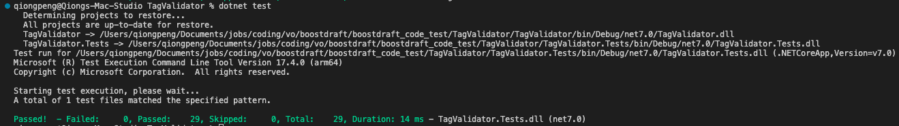

# XML String Validator

## Valid XML String Conditions
### 1.Conditions mentioned in the coding test
-  Each starting element must hava a corresponding ending element
-  Nesting of elements within each other must be well nested.
Besides the aforementioned conditions, I think a valid XML should also make sure that all CDATAs are valid if it has and all tag names are valid.
### 2.<a href="https://www.w3schools.com/xml/xml_elements.asp" target="_blank"> Additional conditions</a>
-  Start with a letter or underscore
-  Cannot start with the letters xml(or XML, or Xml, etc)
-  Can contain letters, digits, hyphens, underscores, and periods
-  Cannot contain spaces

## File Structure
The repository includes TagValidator folder and TAgValidator.Tests foler. TagValidator.cs is the main file for execution of validating XML string, while TagValidator_DetermineXml.cs, TagVAlidator_IsElementMatched.cs, TagVAlidator_isValidCDATA.cs, and TagVAlidator_IsVAlidTAgName.cs are corresponding unit test files.


## How to run unit test
I do unit tests for all functions in TagVaidator.cs. Beside test cases you ask, I include some additional test cases. After you git clone or download the repository, please do the following steps.
```
cd TagValidator
dotnet test
```

## Unit test results
The results of unit tests should looks like the following screenshot.


## Analysis of Time Complexity and Space Complexity
- Time Complexity:
O(n), where n is the number of characters in the string.
- Space Complexity:
O(n), where n is the number of characters in the string, since we need create a stack data stucture to contain tag names.


## Author
**Qiong Peng**
- [Email](mailto:pengqiong2022fall@gmail.com)
- [Website](https://qiongpeng.net/)